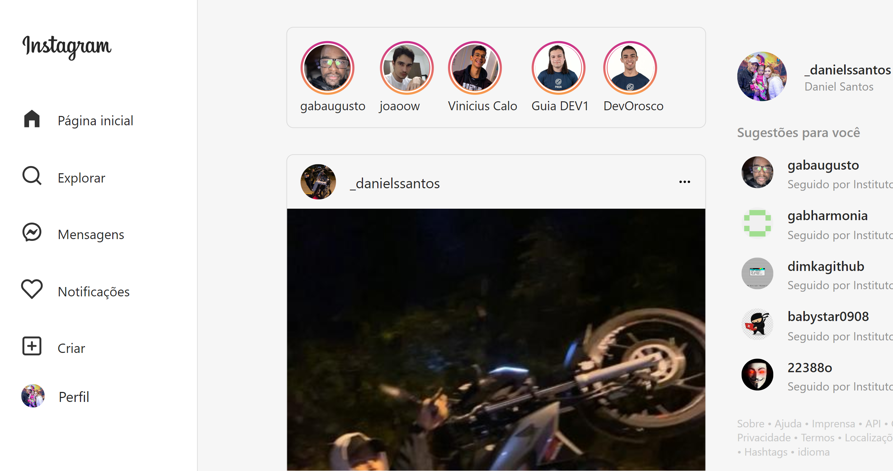

## Clone do Instagram

### Objetivo: construir uma aplicação clone do Instagram utilizando React. 
É necessário que tudo pareça com a página principal do Instagram, então temos que ter posts, comentários, botões para curtir e comentar. Não é necessário que nada funcione, mas se quiser, pode.

O Instagram é uma rede social que opta pela simplicidade: você, em teoria, só faz uma coisa. 
A questão é que o Instagram não á tão simples assim, principalmente quanto ao layout. 

Para que o projeto não fique genérico ou simples demais, vamos dar um foco maior na escolha do conteúdo: imagine que todo o feed do instagram é feito por pessoas que você admira (sejam pessoas reais ou não) e o post de cada uma delas é aquilo que esta pessoa mais quer ver. Escolha algumas pessoas e vamos ver o que sai disso.   

| Tecnologias Utilizadas | |
| ------------- |------------- |
| Linguagem   | JavaScript |
| Biblioteca | React.js, ReactIcons |

|  API Utilizada | 
| ------------- |
| github   |
| |

** **
### O que eu achei do projeto?

Foi meu primeiro contato com React e gostei muito da organização que o React traz com seus componentes. E também da fragmentação que podemos fazer com o React, dividindo os arquivos em componentes e assim pensando em um projeto como  um quebra-cabeça. Bastante interesante para trabalhar em grupo. Consumi a API do github para gerar a foto e nome dos usuários do storys e sugestões de perfis. Curti conhecer um pouco de React e aprende um pouco mais nesse imenso campo da programação. Não pararei por aqui, futuramente trarei mais projetos. :star:
